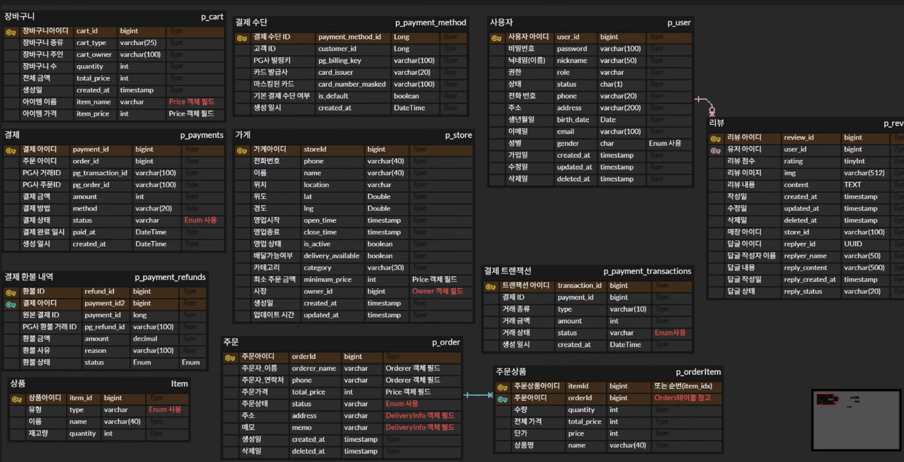

# 프로젝트 개요

## OrderJobABom 배달 서비스
상점에서 원하는 상품을 주문, 결제하면 해당 상품을 배송하는 서비스

## 팀 인원

|                                   김민수                                    |                                 김남주                                  |                                    권민재                                    |
|:------------------------------------------------------------------------:|:--------------------------------------------------------------------:|:-------------------------------------------------------------------------:|
|  |  |  |
|                 [@kmeans00](https://github.com/kmeans00)                 |                   [@RCNR](https://github.com/RCNR)                   |                [@MJakeKwon](https://github.com/MJakeKwon)                 |
|                                  유저, 서버                                  |                                주문, 상품                                |                                    스토어                                    |
## 소개
배달 플랫폼의 기본적인 구조와 도메인 설계를 학습하는 것을 목표로 DDD 기반으로 구현했습니다.

## 기능
### 기본 기능
- 사용자: 회원가입, 로그인, 주문 내역 조회
- 가게: 목록 조회, 검색, 메뉴 조회
- 주문: 주문 생성, 결제, 주문 상태 확인
- 사장님: 메뉴 관리, 주문 접수/처리

### 추가 기능
- 인증/인가: [키클록](https://www.keycloak.org/) 기반 인증 적용
- AI 연동: Gemini를 통한 메뉴명 자동 생성 기능

## 기술 스택
- **Backend**: Java 17, Spring Boot, Spring Security, QueryDSL
- **Infra**: AWS EC2, Docker, Nginx
- **Database**: PostgreSQL
- **Authentication**: Keycloak
- **AI Integration**: Google Gemini  

## ERD

## Appendix
[ppt자료](https://drive.google.com/file/d/1nWJUKFdpqcZ9G8lFBJ0QCGa2wPzGNXnP/view?usp=sharing)